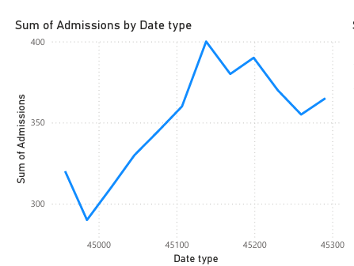

# NHS-Dashboard-PowerBI
To visualize hospital and patient metrics for a fictional NHS trust, enabling leadership to monitor resource usage, patient admissions, wait times, and department performance.
# 🏥 NHS Power BI Dashboard Project

This project presents an interactive dashboard using Power BI to visualize key hospital performance indicators for a fictional NHS trust. It is designed to support decision-making on resource management, patient care efficiency, and departmental performance.

---

## 🎯 Project Objectives

- Create a unified view of operational hospital data
- Monitor trends in patient admissions, discharges, wait times
- Identify capacity gaps in departments (e.g. A&E, surgery, inpatient)
- Support NHS-style data storytelling and public health reporting

---

## 📁 Project Files

| Folder | Content |
|--------|---------|
| `/dataset/` | Excel file with raw NHS-style hospital data |
| `/dashboard/` | Final Power BI file (`.pbix`) |
| `/visuals/` | Screenshots of the dashboard for portfolio viewers |
| `README.md` | Project overview |

---

## 🛠 Tools Used
- Microsoft Power BI Desktop
- Excel (data shaping)
- DAX for calculated columns and measures

---

## 📊 Key Dashboard Pages

- 🧍 Patient Flow (Admissions, Discharges, Bed Days)
- ⏱️ Wait Time & A&E Attendance
- 🏥 Department-Level KPIs
- 📈 Time Trends (monthly/yearly comparisons)

---

## 📸 Sample Visuals

>   
> 

---

## ✅ Future Enhancements

- Connect to live NHS open data via Power BI API or dataflow
- Add slicers for demographics (age, gender, risk)
- Embed into web portal or deploy via Power BI Service
